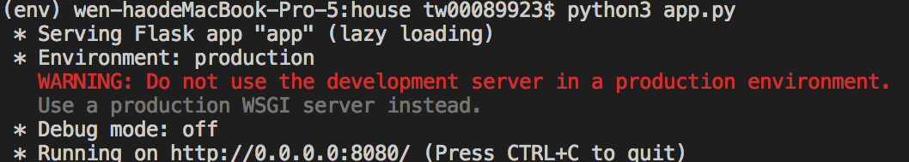
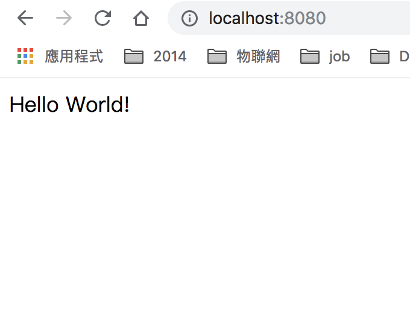

### Taiwan 房價實價登錄 網站
Source
## 目錄
1. 系統環境 與 Package 安裝
2. 編寫 flask 網頁
3. 啟用 [GIT]("https://zlargon.gitbooks.io/git-tutorial/content/startup/create_project.html") 版本控制
## Package
* [Flask](http://flask.pocoo.org)
* [Jinja2](http://jinja.pocoo.org/docs/dev/templates)
* [Flask-resrful](https://flask-restful.readthedocs.io/en/latest/)
* [Flask-sqlachemy ](http://flask-sqlalchemy.pocoo.org/2.3/)
* [Flask-Migrate ](https://flask-migrate.readthedocs.io/en/latest/)
* [Flask-bcrypt ](http://flask-bcrypt.readthedocs.io/en/latest/)
* [WTForms](https://wtforms.readthedocs.io/en/stable/)
* [pytest](https://docs.pytest.org/en/latest/index.html)
* [flask-login](https://flask-login.readthedocs.io/en/latest/)

1. 環境 安裝
<pre>
# 路徑 與 環境
> $ mkdir house && cd mkdir
# 電腦環境 python 3.7
> $ virtualenv env -p python3
# 啟用虛擬環境
> $ source env/bin/activate
# 安裝插件「 可先安裝 flask 即可 」
> $ pip install Flask flask-restful Flask-SQLAlchemy flask-bcrypt flask-login
# 紀錄插件版本
> $ pip freeze > requirements.txt
</pre>

2. 編寫 flask 網頁

<pre>
# 使用 官方 flask 教程
> $ touch app.py

'''
from flask import Flask

app = Flask(__name__)

@app.route("/")
def hello():
    return "Hello World!"

if __name__ == "__main__":
    app.run(host="0.0.0.0",port=8080)
'''
# 很容易在本地開啟網頁

</pre>

3. 啟用 GIT 版本控制
a. 依照git 網頁上 的進行
b. 記得先加入 .gitignore 避免將所有的檔案上傳
<pre>
> $ git init
> $ git add README.md
> $ git commit -m "Flask init"
> $ git remote add origin https://github.com/tw00089923/taiwanhouseprice.git
> $ git push -u origin master
C. 
</pre>

