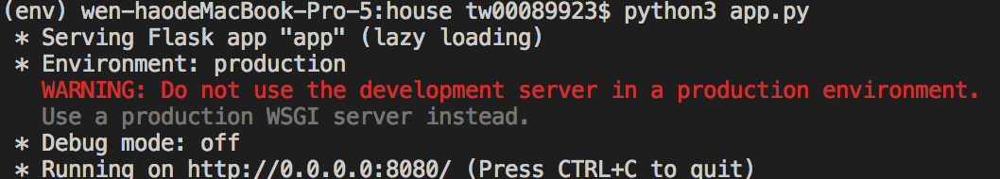
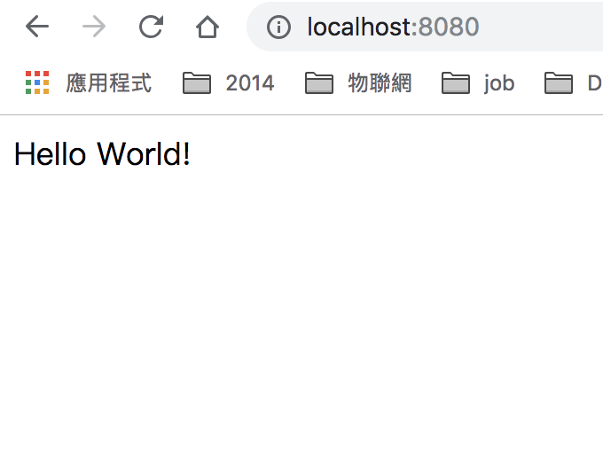

## Taiwan 房價實價登錄 網站
[Source]("http://lvr.land.moi.gov.tw/homePage.action")
```
前端 : npm + Vue
後端語言 : Python 3.7
手機框架 : Flutter
網頁框架: Flask 
資料庫 : PostgreSQL
CI & CD : jinken 
Cluster : kubernete 
```
## start project
```
$ python manage.py run
```

### 目錄
1. [系統環境 與 Package](#1-系統環境與package安裝)
2. [編寫 flask 網頁](#2-編寫flask網頁)
3. [啟用GIT](#3-啟用git版本控制)
### Package
* [Flask](http://flask.pocoo.org) : microframework 
* [Jinja2](http://jinja.pocoo.org/docs/dev/templates) :  the syntax and semantics of the template engine
* [Flask-resrful](https://flask-restful.readthedocs.io/en/latest/) : building REST APIs
* [Flask-sqlachemy ](http://flask-sqlalchemy.pocoo.org/2.3/) : support for ORM SQLAlchemy 
* [Flask-Migrate ](https://flask-migrate.readthedocs.io/en/latest/) : handles SQLAlchemy database migrations 
* [Flask-bcrypt ](http://flask-bcrypt.readthedocs.io/en/latest/) : provides bcrypt hashing utilities
* [WTForms](https://wtforms.readthedocs.io/en/stable/) :  Form input handling and validation
* [pytest](https://docs.pytest.org/en/latest/index.html) :  makes it easy to write small tests
* [flask-login](https://flask-login.readthedocs.io/en/latest/) : provides user session management
### 1. 系統環境與Package安裝
<pre>
# 路徑 與 環境
> $ mkdir house && cd mkdir
# 電腦環境 python 3.7
> $ virtualenv env -p python3
# 啟用虛擬環境
> $ source env/bin/activate
# 安裝插件「 可先安裝 flask 即可 」
> $ pip install Flask flask-restful Flask-SQLAlchemy flask-bcrypt flask-login flask-jwt flask-script flask_migrate
# 紀錄插件版本
> $ pip freeze > requirements.txt
</pre>
### 2. 編寫flask網頁
<pre>
# 使用 官方 flask 教程
> $ touch app.py

'''
from flask import Flask

app = Flask(__name__)

@app.route("/")
def hello():
    return "Hello World!"

if __name__ == "__main__":
    app.run(host="0.0.0.0",port=8080)
'''

# 輸入指令 python run.py

# 本地開啟網頁


</pre>
### 3. 啟用GIT版本控制
```
a. 依照git 網頁上 的進行
b. 記得先加入 .gitignore 避免將所有的檔案上傳
```
<pre>
> $ git init
> $ git add README.md
> $ git commit -m "Flask init"
> $ git remote add origin https://github.com/tw00089923/taiwanhouseprice.git
> $ git push -u origin master
</pre>

### 4. Flask 初始化所有插件 
'''
# 為了方便管理Development,Production流程的狀態,編寫 config.py
> $ touch config.py 
# 初始化 flask_restful flask_sqlalchemy flask_bcrypt flask_login flask_jwt
> $ nano app.py
# 初始化 flask-script & flask_migrate 
> $ touch manage.py
# 新增路徑 router.py models.py api.py
> $ mkdir application && cd application
> $ touch api.py && touch models.py && touch router.py
'''

### 5. 整理開放資料 
[政府 Open Data]("http://plvr.land.moi.gov.tw/DownloadOpenData")
仔細觀察 download_path 資料 從101第三季 一直到 107第三季 
http://plvr.land.moi.gov.tw//DownloadSeason?season=101S3&type=zip&fileName=lvr_landcsv.zip"
http://plvr.land.moi.gov.tw//DownloadSeason?season=107S3&type=zip&fileName=lvr_landcsv.zip"
# google jupyter
https://colab.research.google.com/drive/1068kiQ21pPSFjMxrwoqdOJo5tV_PmPgf

### 5. Dockerfile  - python3.7 
# t : tag
$ docker build -t howard/flask .  
# --name : name , -p : port  ,-d : run inthe background
$ docker run -id --name flask -p 8080:8080 howard/flask
# 進入container
$ docker exec -it flask sh
# 確認完 container 執行正常並刪除 image
$ docker stop flask && docker rm flask 

$ docker logs
### 6. Dockerfile  - redis

### 6. Docker-compose


### 7. Kubernete : Get started with a cluster
